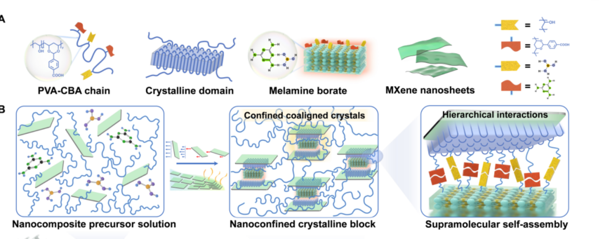

## Prompt:

## Response:
这张示意图分为两部分，帮助说明一种 PVA-CBA / MXene / 三聚氰胺-硼酸盐（melamine borate）纳米复合水凝胶的层级自组装机理：

* * *

### A. 组成与相互作用单元

1.  **PVA-CBA 长链**
    
    *   以聚乙烯醇 (PVA) 为主链，接枝对-羧基苯乙烯 (CBA)。
        
    *   PVA 上大量 –OH，CBA 提供 –COOH，后续能与硼酸或 MXene 表面基团形成多重氢键/配位键。
        
2.  **结晶区 (Crystalline domain)**
    
    *   PVA 链在冷冻-融化或其它诱导条件下可形成微区结晶，起到“物理交联结点”的作用。
        
3.  **三聚氰胺-硼酸盐 (Melamine borate)**
    
    *   三聚氰胺多 N-H 位点 + 硼酸易与 –OH / –COOH 形成 B–O-C 键，兼具阻燃与动态可逆交联功能。
        
4.  **MXene 纳米片**
    
    *   如 Ti₃C₂Tx，表面富含 –OH、–F、–O 基团；二维片层可提供高导电性与机械增强。
        
    *   纳米片还能限制 PVA 结晶、生长方向，形成“纳米限域晶体块”。
        
5.  **图右小插图**
    
    *   黄色/红色积木状符号表示不同类型的可逆键：
        
        *   黄-黄：PVA 结晶物理交联
            
        *   黄-红：–COOH/–OH 与硼酸 B–O-C 键
            
        *   红-红：三聚氰胺-硼酸与 MXene、或三聚氰胺与 CBA 间氢键
            

* * *

### B. 从前驱溶液到层级结构

1.  **Nanocomposite precursor solution**
    
    *   PVA-CBA 链 (蓝色波浪) 均匀分散；MXene 片 (绿色) 和 melamine-borate (小分子/簇) 随机漂浮。
        
2.  **Nanoconfined crystalline block**
    
    *   经过冷冻-融化或加热诱导，PVA 结晶在 MXene 限域空间内“定向共晶”。
        
    *   形成若干含 MXene 的“微晶块”，被柔性链串联。
        
3.  **Supramolecular self-assembly (放大图)**
    
    *   顶部 MXene 片层与下方“纳米限域晶体块”之间，通过：
        
        *   **物理结晶结点** (PVA 晶区)
            
        *   **动态 B–O-C 配位**
            
        *   **氢键网络**
            
    *   构建出多级（分子-纳米-微米）协同交联，使水凝胶兼具高强度、可拉伸、快自修复、阻燃及导电性能。
        

* * *

#### 可以帮您做什么？

*   进一步拆解具体化学键类型、力学贡献？
    
*   总结该结构对阻燃或导电性能的提升机理？
    
*   帮您写 PPT / Canva 图示的中文解说词？
    
*   设计实验或仿真方案验证这种层级自组装？
    

告诉我您接下来想深入的方向！

